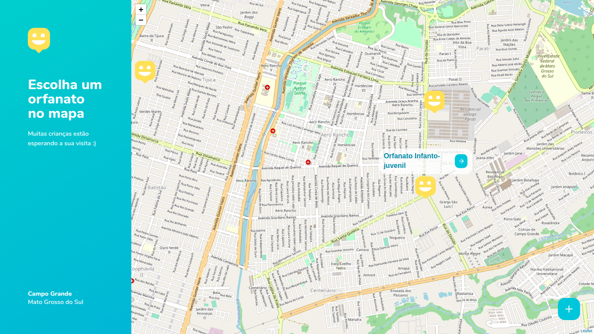
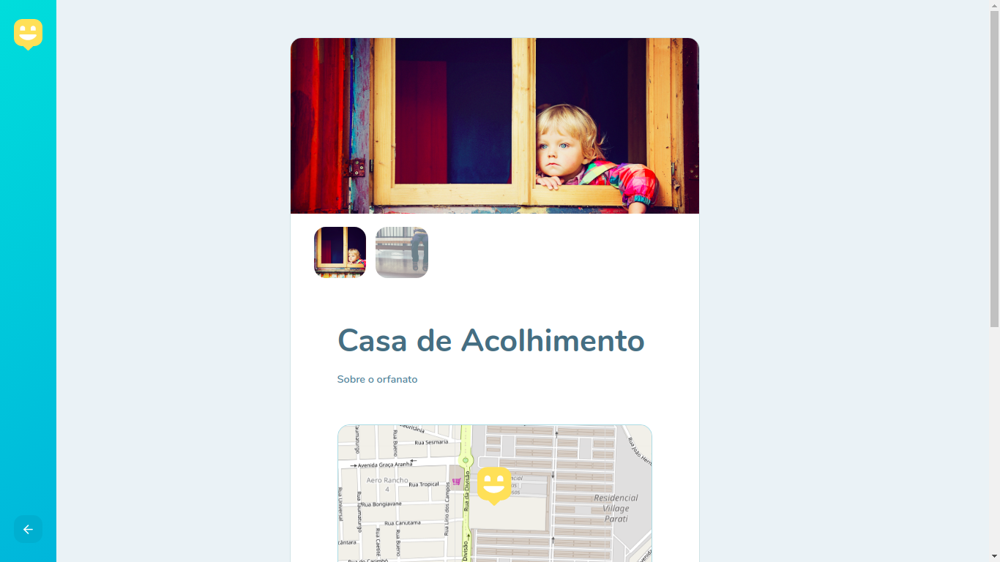

<h1 align="center">
    
</h1>

# 💻 Anotações do NLW 3

## Sumário

- [1. Acelerando sua evolução](#1-acelerando-sua-evolução)
- [2. Olhando as oportunidades](#2-olhando-as-oportunidades)
- [3. A escolha da stack](#3-a-escolha-da-stack)
- [4. Até 2 anos em 2 meses](#4-até-2-anos-em-2-meses)
- [5. A milha extra](#5-a-milha-extra)
- [6. Layout](#6-layout)
- [7. Capturas de Tela](#7-capturas-de-tela)


# 1. Acelerando sua evolução

### Iniciar o projeto web com React:

```jsx
yarn create react-app web --template typescript
```

### Adicionar ícones no React:

```jsx
yarn add react-icons
```

### Criar Rotas no Front-end + Type do Pacote

```jsx
yarn add react-router-dom
yarn add @types/react-router-dom -D
```

### Pacote de Mapas + Type do Pacote

```jsx
yarn add leaflet react-leaflet
yarn add @types/react-leaflet -D
```

[React-Leaflet · ⚛️ React components for 🍃 Leaflet maps](https://react-leaflet.js.org/)

# 2. Olhando as oportunidades

### Iniciando o back-end:

```jsx
yarn init -y
```

### Pacote do express + Tipagem do pacote

```jsx
yarn add express
yarn add @types/express -D
```

### Instalação do Typescript

```jsx
yarn add typescript -D
```

### Arquivo de configuração do Typescript

```jsx
yarn tsc --init
```

### Pacote ts-node-dev - para executar o projeto utilizando Typescript no NodeJS

```jsx
yarn add ts-node-dev -D
```

### Typeorm + Sqlite no NodeJS - ORM

```jsx
yarn add typeorm sqlite3
```

### Migrations

### Versionamento de banco de dados

### No arquivo ormconfig.json deve ser inserido as seguintes linhas de código

```jsx
"migrations": [
    "./src/database/migrations/*.ts"
  ],
  "cli": {
    "migrationsDir": "./src/database/migrations"
  }
```

### No arquivo package.json deve ser inserido as seguintes linhas de código em "scripts"

```jsx
"typeorm": "ts-node-dev ./node_modules/typeorm/cli.js"
```

### Criar uma migrations

```jsx
yarn typeorm migration:create -n NOME DA SUA MIGRATION
```

### Como é as migrations

### No método up é colocado o que deve ser feito no banco de dados, exemplo a criação de uma nova tabela.

### No método down é colocado o que vou desfazer no banco de dados, exemplo excluir uma tabela ou campo dessa tabela.

```jsx
import {MigrationInterface, QueryRunner, Table} from "typeorm";

export class createOrphanages1602649384381 implements MigrationInterface {

  public async up(queryRunner: QueryRunner): Promise<void> {
    await queryRunner.createTable(new Table({
      name: 'orphanages',
      columns: [
        {
          name: 'id',
          type: 'integer',
          unsigned: true,
          isPrimary: true,
          isGenerated: true,
          generationStrategy: 'increment'
        },
        {
          name: 'name',
          type: 'varchar',
        },
        {
          name: 'latitude',
          type: 'decimal',
          scale: 10,
          precision: 2,
        },
        {
          name: 'longitude',
          type: 'decimal',
          scale: 10,
          precision: 2,
        },
        {
          name: 'about',
          type: 'text',
        },
        {
          name: 'instructions',
          type: 'text',
        },
        {
          name: 'open_on_weekends',
          type: 'boolean',
          default: false,
        }
      ],
    }))
  }

  public async down(queryRunner: QueryRunner): Promise<void> {
    await queryRunner.dropTable('orphanages')
  }

}
```

### Executar as migrations

```jsx
yarn typeorm migration:run
```

### Observação importante: Só pode alterar uma migrations que não foram enviados para o sistema de controle de versão Exemplo: Git.

### Só pode alter migrations que estão somente na sua maquina.

### Para desfazer uma migrations

```jsx
yarn typeorm migration:revert
```

### Para ver todas as migrations executadas

```jsx
yarn typeorm migration:show
```

### Biblioteca de Upload de Imagens + Tipagem

```jsx
yarn add multer
yarn add @types/multer -D
```

### Tratativa de erros

```jsx
yarn add express-async-errors
```

### Validação de Dados + Tipagem

```jsx
yarn add yup
yarn add @types/yup -D
```

### Permitir que a aplicação seja acessível em diferentes domínios

```jsx
yarn add cors
yarn add @types/cors
```

# 3. A escolha da stack

### Foi feito a integração do API feita no Back-end com Front-end Web da aplicação.

### Requisição do front-end para o back-end

```jsx
yarn add axios
```

# 4. Até 2 anos em 2 meses

# 5. A milha extra

# 6. Layout

[Web](https://www.figma.com/file/5NiUl8ELhzfg13C8ySEy0v?embed_host=notion&kind=&node-id=0%3A1&viewer=1)

[Mobile](https://www.figma.com/file/vGhEVpuAPfdBk6UZP2iN7K?embed_host=notion&kind=&node-id=0%3A1&viewer=1)

# 7. Capturas de Tela
<h1 align="center">
    
    
</h1>
Feito com 💜 por <a href="https://www.linkedin.com/in/hantonny-korrea-2853911a0/"><b>Hantonny Korrea</b></a> durante a Next Level Week #3 by <a href="https://rocketseat.com.br/">Rocketseat</a>